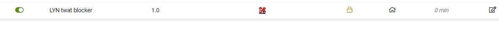

# LYN-ostrich-app 
Also known as the twat blocker, a tampermonkey script that blocks annoying trolls on Lowyat.net forum  
 
Ever been pestered by annoying trolls on lowyat net forum? The ban list built in on lowyat net merely stops others from private messaging 
you but does not stop them from flaming and harassing you.

  

Example : look at this guy, he doesnt know how to play nice with others.He is always finding ways to rile up everyone. Thats fine. 
We want to enjoy a nice discussion when we go on the internet and we do not need to put up with his rudeness.

  

 
 
 

 

So what we gonna do is we gonna is 

1) Install tampermonkey on your chrome browser.
2) Copy the code in index.js.
3) Create a new script in tampermonkey and paste the exact code in it.
4) Put his user name in an array called blockedlist.
5) Save.

 

            

            
Make sure the tampermonkey is enabled

            

            
  and Taaadaa...... his post will never be seen again , and post quoting his post will also be missing. The only time it wont work is if he is the thread starter. In which case i did not make the script censor the post because it would look weird for a thread to being out of nowhere. 
  
  
